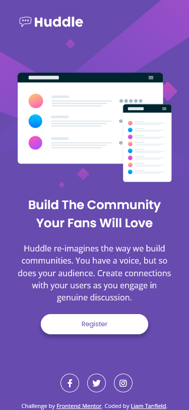
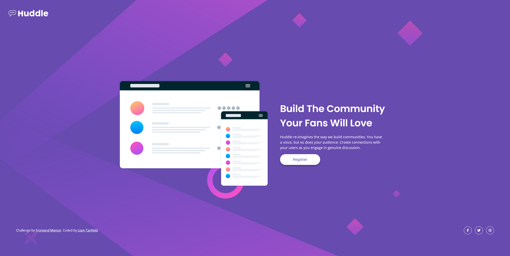

  

  <h1 align="center">Huddle Landing Page With A Single Introductory Section</h1>
  

    <a href=https://www.frontendmentor.io/challenges/huddle-landing-page-with-a-single-introductory-section-B_2Wvxgi0><strong>Huddle landing page with a single introductory section</strong></a>
     
     
    <a href="https://lighthearted-sherbet-bcf825.netlify.app/">View Demo</a>
    ·
    <a href="my solution link here" target="_blank">Leave a comment</a>
  

<!-- Badges -->

  <!-- Profile -->
  
  <!-- Status -->
    

#

This is a solution to the [Huddle landing page with a single introductory section](https://www.frontendmentor.io/challenges/huddle-landing-page-with-a-single-introductory-section-B_2Wvxgi0). Frontend Mentor challenges help you improve your coding skills by building realistic projects.

<h2 align="center">Links</h2>

- Solution URL: [solution URL](url here too)
- Live Site URL: [https://lighthearted-sherbet-bcf825.netlify.app/](https://lighthearted-sherbet-bcf825.netlify.app/)

 

## Table of Contents

- [Overview](#overview)
  - [The Challenge](#the-challenge)
- [My Process](#my-process)
  - [Built With](#built-with)
- [What I Learned](#what-i-learned)
- [Author](#author)
- [Useful Resources](#useful-resources)

## Overview

### The Challenge

Users should be able to:

- View the optimal layout depending on their device's screen size
- See hover states for all interactive elements on the page

## My Process

It felt very good to come back and start a new project. I unforunately had a hectic past 2 months of falling ill and at the same time moving house! Thankfully I am in better health and have now settled in my new place! :)

While I took a break, I also finally started learning SASS, I have found it quite interesting if not a bit confusing at first, I chose not to use this project with SASS but I intend on implementing it with my next project.

But on to the project!

I will start with the style-guide.md file. Then I will try to gauge what fonts were used in which areas awhile making my --custom properties.

I struggled with the desktop version on this project frankly, I ended up restarting over again only once as I just felt I could do it a lot better than how it turned out, plus taking some time off sick really put me in a rut whilist I was learning. Thankfully I am happy on how this turned out!

I tried something new and instead went desktop first then mobile, it was interesting trying to make everything smaller, I think I prefer a mobile first approach but I can see how sometimes trying desktop first if you are struggling can actually help you figure things out better!

Other than that, I didn't run into many issues as I was making this project.

I did learn about FontAwesome and I like how easy it is to find svg icons! I noticed a few people either use the FA Kits or just use the CDN library, is there much difference in which you use or pros/cons with both?

### Built With

<!-- Badges -->

- Semantic HTML5 markup
- Pure CSS3
- [Prettier (CSS Formatter)](https://prettier.io/)
- [Visual Studio Code (Editor)](https://code.visualstudio.com/)

## What I learned

- Implementing icons via FontAwesome
- Modifying images with `object-fit`

## Useful Resources

- [object-fit](https://developer.mozilla.org/en-US/docs/Web/CSS/object-fit)

## Author

- Frontend Mentor - [@YorkieLT](https://www.frontendmentor.io/profile/YorkieLT)
